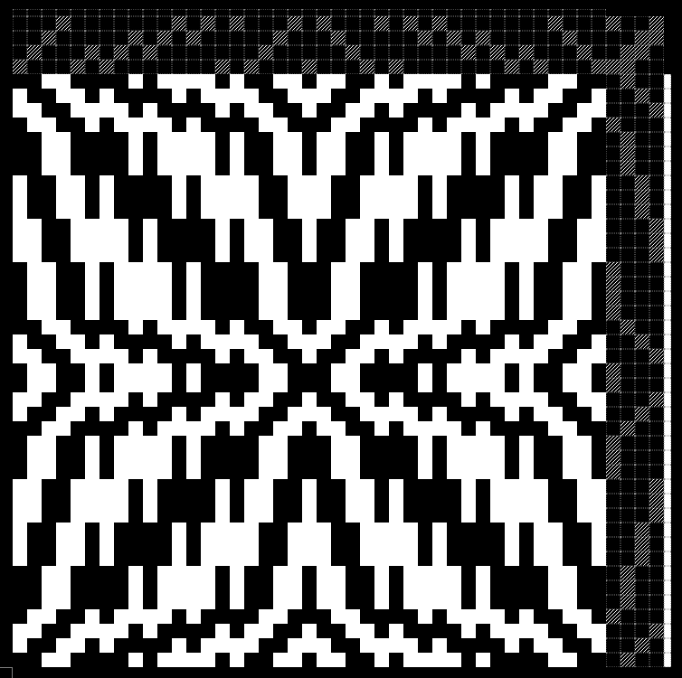

*this is a work in progress*

# woving

*woving* is a domain specific pattern language, or notation system, for writing concise loom draft instructions. It implements features commonly found in weaving, like repetition and symmetry, into the language itself.

## syntax and example

**instructions for a loom draft**, whether those for the threading or for the treadling sequence, can be thought of as an array of numbers. seen in this image, the striped cells at the top and right-hand side represent the instructions graphically.



*this screenshot is from another digital weaving project of mine [woven images](https://pcsteppan.github.io/woven-images/)*

**as just numbers** though the threading and treadling would be:
1. ```234122233344411112341143211114443332221432```
2. ```12341212323434141234143214143432321214321```

**in woving**, those lengthy sequences collapse down into a conciser and clearer form, denoting repetition, symmetry, and where values move incrementally up or down:

1. ```[2341 2:3 3:3 4:3 1:4 2341]|```
2. ```[/14/12/1324/3414/14/1]!```

some transformations happening here are:
+ ```1:4``` would become ```1111``` (repetition)
+ ```/141/``` would become ```1234321``` (a 'step array')
+ ```123|``` would become ```123321``` (symmetry)
+ ```123!``` would become ```12321``` (odd symmetry, or 'point symmetry')


## getting set up locally

1. install nearley.js with ```npm install -g nearley```
2. Compile the woving.ne file (which contains the grammar for the language) with ```nearleyc woving.ne -o woving.js```
3. install node packages ```npm install```
4. run the test suite with ```npm test```
